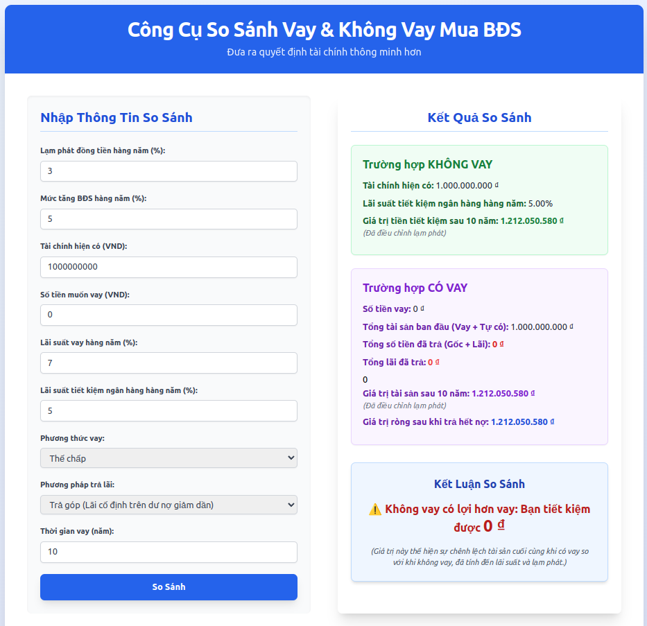

# Công Cụ So Sánh Vay & Không Vay Mua Bất Động Sản

Ứng dụng này giúp bạn so sánh giá trị tài sản ròng trong tương lai giữa hai kịch bản: **không vay** (chỉ tiết kiệm) và **có vay** (mua BĐS bằng vốn tự có và vay nợ), sau khi điều chỉnh lạm phát.

---

## Các Thông Số Đầu Vào Chính

* **Lạm phát đồng tiền hàng năm**: Tỷ lệ lạm phát dự kiến.
* **Mức tăng BĐS hàng năm**: Tỷ lệ tăng trưởng giá BĐS dự kiến.
* **Tài chính hiện có**: Số tiền bạn đang có.
* **Số tiền muốn vay**: Số tiền dự định vay.
* **Lãi suất vay hàng năm**: Lãi suất ngân hàng cho khoản vay.
* **Lãi suất tiết kiệm ngân hàng hàng năm**: Lãi suất gửi tiết kiệm.
* **Phương pháp trả lãi**: Trả góp (Annuity - dư nợ giảm dần) hoặc Trả đều gốc + Lãi theo dư nợ ban đầu (Flat).
* **Thời gian vay (năm)**: Kỳ hạn khoản vay.

---

## Các Công Thức Tính Toán

Các công thức dưới đây đều sử dụng **tỷ lệ thực tế** đã điều chỉnh lạm phát:
* **Tỷ lệ tăng trưởng tiết kiệm thực tế** = $(1 + \text{Lãi suất tiết kiệm}) / (1 + \text{Lạm phát}) - 1$
* **Tỷ lệ tăng trưởng BĐS thực tế** = $(1 + \text{Mức tăng BĐS}) / (1 + \text{Lạm phát}) - 1$

### Kịch Bản 1: KHÔNG VAY

* **Giá trị tiền tiết kiệm sau X năm**:
    $$\text{Tài chính hiện có} \times (1 + \text{Tỷ lệ tăng trưởng tiết kiệm thực tế})^{\text{Thời gian vay (năm)}}$$
    * Đây là giá trị **sức mua thực tế** của tiền tiết kiệm sau thời gian tính toán.

---

### Kịch Bản 2: CÓ VAY

1.  **Tính Tổng Tiền Đã Trả (Gốc + Lãi)**:
    * **Phương pháp trả góp (Annuity)**:
        $$\text{Tiền trả hàng tháng} = \frac{\text{Số tiền vay} \times \text{Lãi suất tháng} \times (1 + \text{Lãi suất tháng})^{\text{Số kỳ}}}{(1 + \text{Lãi suất tháng})^{\text{Số kỳ}} - 1}$$       $$\text{Tổng số tiền đã trả} = \text{Tiền trả hàng tháng} \times \text{Số kỳ}$$
    * **Phương pháp trả đều gốc (Flat)**:
        $$\text{Tổng lãi đã trả} = \sum (\text{Dư nợ còn lại} \times \text{Lãi suất tháng})$$       $$\text{Tổng số tiền đã trả} = \text{Số tiền vay} + \text{Tổng lãi đã trả}$$

2.  **Giá trị tài sản sau X năm**:
    $$\text{Tổng tài sản ban đầu} \times (1 + \text{Tỷ lệ tăng trưởng BĐS thực tế})^{\text{Thời gian vay (năm)}}$$
    * **Tổng tài sản ban đầu** = Tài chính hiện có + Số tiền muốn vay.
    * Đây là giá trị **thực tế** của BĐS sau thời gian tính toán.

3.  **Giá trị ròng sau khi trả hết nợ**:
    $$\text{Giá trị tài sản sau X năm} - \text{Tổng số tiền đã trả}$$
    * Đây là giá trị **thực** còn lại của bạn sau khi thanh lý BĐS và trả hết nợ.

---

### Kết Luận So Sánh

* **Lợi ích từ việc vay**:
    $$\text{Giá trị ròng sau khi trả hết nợ (Có vay)} - \text{Giá trị tiền tiết kiệm sau X năm (Không vay)}$$
    * Nếu kết quả **dương**: Vay có lợi hơn. 🎉
    * Nếu kết quả **âm**: Không vay có lợi hơn. ⚠️

---



```
npm create vite@latest loan_project --template react
cd loan_project
npm install
npm install -D tailwindcss@3.4.3 postcss autoprefixer
npx tailwindcss init -p
npm run dev
```