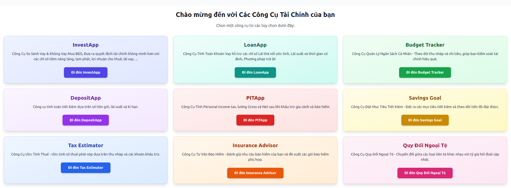
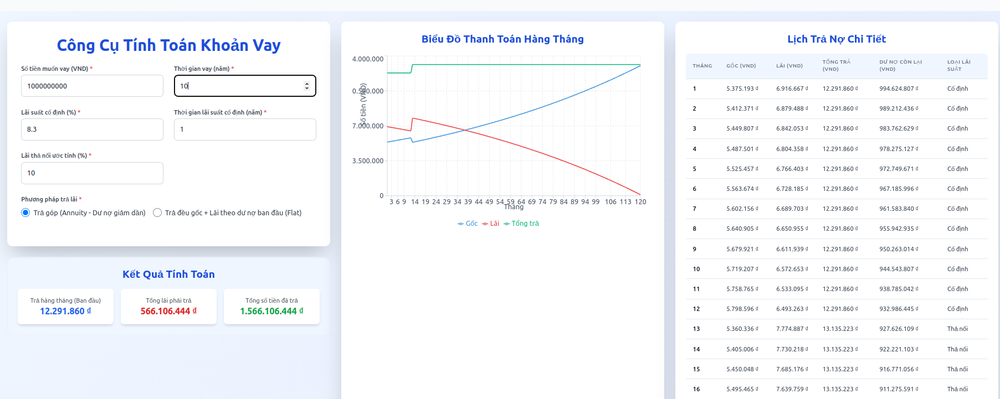

# My Financial Hub 💰

**My Financial Hub**\! là một bộ sưu tập các công cụ tài chính hữu ích được thiết kế để giúp bạn quản lý tài chính cá nhân hiệu quả hơn, từ việc đưa ra quyết định đầu tư, quản lý khoản vay, tiết kiệm, cho đến tính toán thuế và chuyển đổi ngoại tệ.

-----





## Các Tính Năng Chính ✨

Dưới đây là tổng quan về các công cụ bạn sẽ tìm thấy trong ứng dụng này:

### 1\. InvestApp 📈

  * **Mô tả:** Công cụ so sánh các kịch bản mua bất động sản có vay và không vay, cung cấp các chỉ số quan trọng như tiềm năng tăng giá, lạm phát, lợi nhuận cho thuê và lãi suất vay. Giúp bạn đưa ra quyết định đầu tư thông minh hơn.

### 2\. LoanApp 🏦

  * **Mô tả:** Công cụ tính toán khoản vay, hỗ trợ các chỉ số như lãi suất thả nổi ước tính, lãi suất và thời gian cố định, cùng với các phương pháp trả lãi khác nhau.

### 4\. DepositApp 💵

  * **Mô tả:** Công cụ tính toán tiết kiệm dựa trên số tiền gửi, lãi suất và kỳ hạn, giúp bạn dễ dàng hình dung số tiền sẽ nhận được trong tương lai.

### 5\. PITApp (Personal Income Tax) 📝

  * **Mô tả:** Công cụ tính toán thuế thu nhập cá nhân (PIT), hỗ trợ tính toán lương Gross và Net sau khi khấu trừ gia cảnh và bảo hiểm, giúp bạn hiểu rõ nghĩa vụ thuế của mình.

-----

## Cài Đặt và Chạy 🚀

```
npm create vite@latest loan_project --template react
cd loan_project
npm install
npm install -D tailwindcss@3.4.3 postcss autoprefixer
npx tailwindcss init -p
npm run dev
```